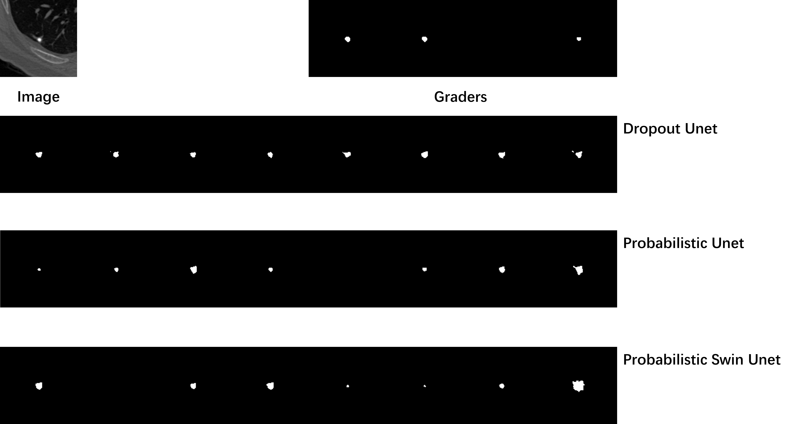
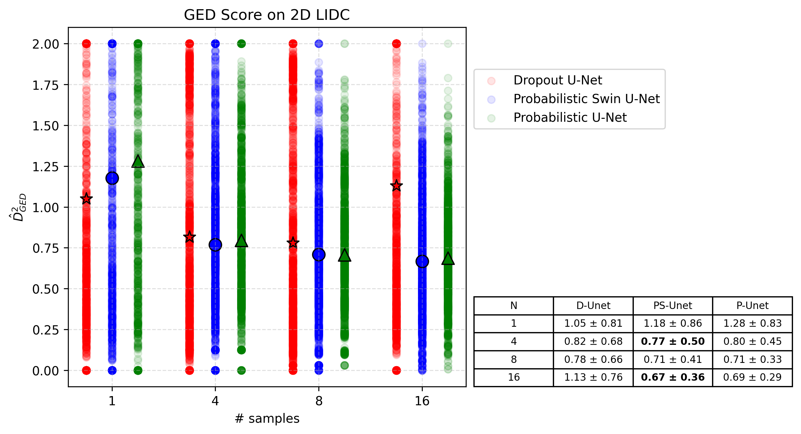
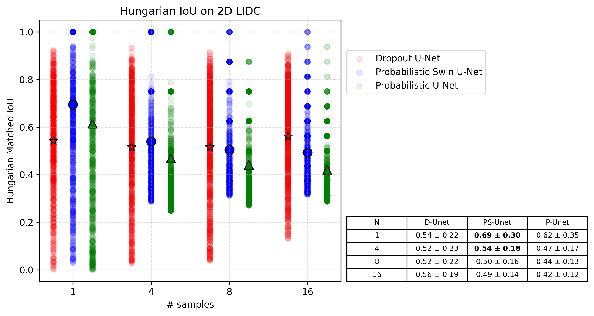

# Pytorch Implementation of the Probabilistic Swin Unet 
This is a Pytorch Implementation of the Probabilistic Swin Unet. 
The model is trained on 2D LIDC dataset. We will work on another dataset.

*Results on 2D LIDC data*

The figure below shows the segmentation results of Probabilistic Unet, Probabilistic Swin Unet and the Monte Carlo Dropout Unet.

Figures below illustrate results of the generalized energy distance (GED) and Hungarian IoU.

## About this repository
The main structure is in the `probabilistic_unet.py`. Switching between normal Unet backbone or Swin Unet backbone could be operated by changing the `self.unet` between `Unet` and `SwinUnet2D`.
