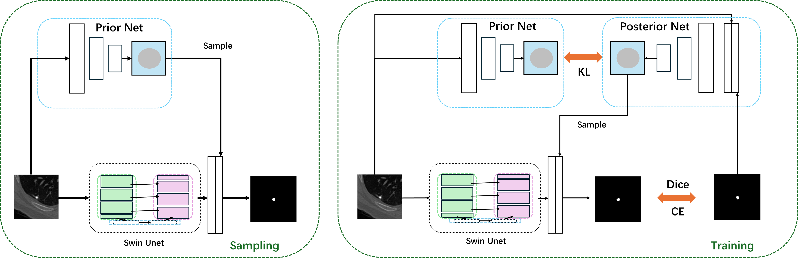

# Probbailistic Swin Unet

This repository provides an implementation of the Probabilistic Swin Unet, a model that integrates probabilistic latent distributions with a Swin Transformer-based encoder-decoder framework.
## 1. Data
You can feel free to deal with [LIDC-IDRI dataset](https://www.cancerimagingarchive.net/collection/lidc-idri/). Or you can use the preprocessed dataset in a `.pickle` file at [Google Cloud](https://drive.google.com/file/d/1VZmHbnwd-XkapzrsjL9yCrnT1ERDoqw9/view?usp=sharing). The data is cropped to a resolution of (128,128), with a fixed spacing. 
## 2. Envrionment
You should prepare an environment with python >= 3.10, and use the command for dependencies:
```
pip install -r requirements.txt
```
## 3. Train/test
We use Wandb to monitor our training progress. Details can be seen here: [wandb](https://wandb.ai/site)
The hyperparameters can be modified in the script of the probabilistic_swin_unet. You should also prepare the data properly.
You can train the model by simply using
```
python train.py
```
